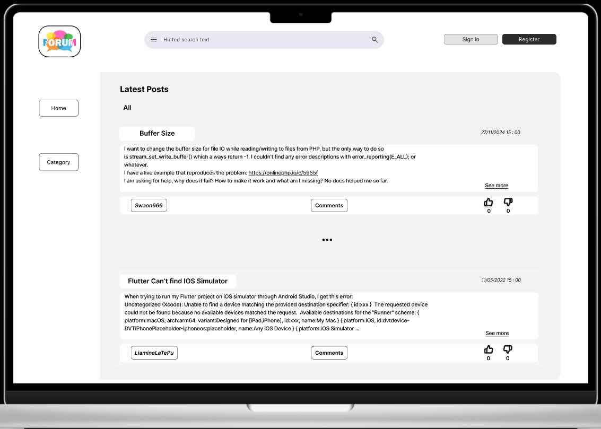
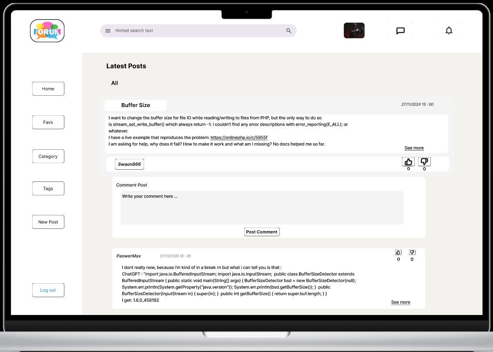
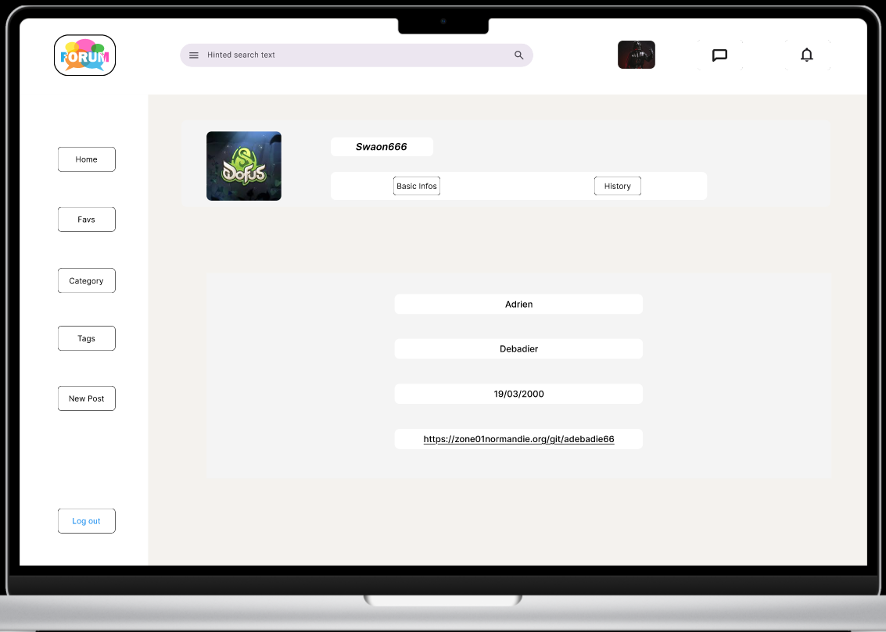
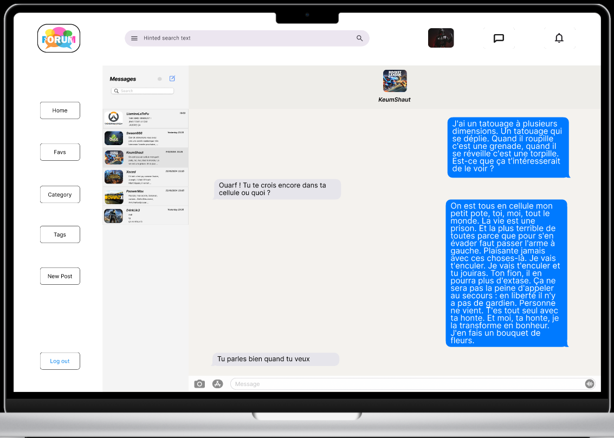

# Forum 

## Specifications 

### Project main goals

In this project we have to create a Forum web-application.

#### Communication between users 

In order for users to communicate between each other, they'll have to be able to create Posts and Comments which'll only be allowed to registered users.

I think displaying latest Posts first when accessing the home page is the more coherent course of action as well as accessing the latest comments for each post first.

##### Posts

- Create Posts : Registered user should be able to write and publish a Post. 

- Filters : Registered users can filter the displayer post by

    - Categories (all users).
    - Own created Posts.
    - Liked Posts.
    - (Favorite Posts).

- Likes : Liking or disliking Posts is only available to registered users.

    - I'd prefer the user not to be able to like/dislik his own Posts.

- History : the user should be able to access the history of 

    - His published Posts.
    - His liked/disliked Posts.

- (Modify/Delete his own Posts).

##### Comments

- Comment existing Posts is for registered users only.

- Like/dislike comments.

    - Same here, I'd prefer the user not to be able to like/dislike his own comment.

- (Modify/Delete his own comments).

- History : user should be able to see all his published comments.

#### Authentication

Clients must be able to register as new users on the Forum by inputting their credentials as well as log in.

The use of cookies is essential to allow each user to have only one opened session :
- Each session must contain an expiration date.

##### Register

- User registration :

    - Username.
    - Email.
    - Password.
    - (FirstName).
    - (LastName).
    - (BirthDate).

The web application must be able to check if the Email address is present in the database and if all credentials are correct.

Users should be able to register using at least Facebook and Google.

##### Log in

- User Login :

    - Username/Email.
    - Password.

When logging, the Forum must be able to check if the entered password is the same as the one provided in the database.

Users should also be able to Log in using at least Facebook, Github and Goolge.

#### Moderation

Moderation is essential for a Forum to control the displayed content so that it respects the Terms and Conditions of Use (TCUs).

The content must be appropriate : respectful, relevant; not obscene, illegal or insulting.

To check the conformity of the Forum content we'll need a moderation system with several levels.

##### Guest

- Guests : unregistered users that can only read the Posts and Comments, they also can search for a Post topic using the search bar or by Category.

##### Basic User 

- Users : Able to create, comment, like or dislike posts:

    - They 'll also be able to modify/delete their own Posts/Comments.

    - They should be able to request to be promoted to moderator to the admin.

##### Moderator

- Moderators : they have the same options than the basic users but with some special features :

    - Report or delete users/Posts or comments to admin.
    - Report/Ban users.
    - Request a user moderator promotion to the admin.

##### Administrator

- Admin : Above the moderator, he manages the technical details required for running the Forum :

    - Promote/demote user to moderator or back to basic user.
    - Receive reports from moderators.
    - Delete Posts/Comments/users 
    - Manage categories (add/delete them).

### Security

Having a secure web application is not an option. So we need to encrypt the connection, the client's password and even the database.

#### HTTPS protocol

- Encrypted connection : SSL certificate

    - Created or using CA's (Certificate Authoritites).

- Cipher suite : TLS (Transport Layer Security)

    - Key exchange (encryp/decrypt messages).
    - Bulk encryption.
    - MAC (Message Authentication Code).

#### Rate Limiting

- Control of the rate of requests sent or received, to prevent :

    - DoS attacks (Denial-of-Service) : cyber-attack rendering a machine/network ressource unavailable to its users by disrupting services of a host connected to a network.
    - Web scraping : data extraction from websites by copying the database.

#### Unique client session cookies

- Session state is stored on the server & should present an unique identifier so the client has no direct access to it.

    - Impossible for attackers to read/tamper with session states.

### Compatibility

- Must work on the main web browers (chrome, safari, Firefox, Edge).
- If we have enough time, doing a mobile app would be great.

## Epics/user stories/Back log : global features of the project 

- Epic : Create a web application which allow users to communicate via posts/comments.

- User stories :
    - Be able to register/Login.
    - Be able to make a post.
    - Be able to choose one/multiple categories fo the post .
    - Be able to like/dislike a post/comment .
    - Be able to see the history of created/liked-disliked posts and comments.
    - Be able to see all posts and comments from selected categories.

- Back log :
    - Authentication : email/username/password + error handling
    - Post creation : registered users only :
        - Choose one/multiple categories for the post. 
    - Like-dislike posts/comments : registered users only.
    - SQLite : 
        - History of created posts/comments and likes-dislikes : registered users only.
        - History of all posts/comment from selected categories : ALL users 
    
    ### User stories 

The project started with the determination of the Main Epic and the different user stories.
The Epic represents the major objective of the project and the user stories the different features needed to respond to the customer's demands.
These user stories are prioritized to determine which ones we should do first : 
- High priority
- Moderate priority
- Low priority 

They also contain validation criteria to ensure that the functionality is correctly implemented.

## Data dictionary 

It details the database we use in our informative system. It’s used by devs & database admins, and is really helpful in its précise data description.

### User
#### First draft

#### Final version

### Session
#### First draft

#### Final version

### Posts
#### First draft

#### Final version

## MERISE Method

This method is useful to link the different elements of our project together. 
To follow this method we used the free Looping software which is intuitive and simple to apprehend.

###  Conceptual Data Model

Entities are represented by the Yellow rectangles and contain their different attributes.
Blue links associate the entities to each other when needed, they sometime have to contain some attributes as well, they also indicate how many times 2 Entities can be associated to each other : 
 - One to one (1,1) : Each entity occurrence is only linked to one occurrence of another entity.
- Zero or One to Many  (0,n) : One entity occurrence can be (or not) associated with several occurrences of another entity.

#### First draft

#### Final version

### Logical Data Structure 

It’s used to detail entity relations. The links defined in the CDM are translated into primary and foreign keys to establish the relations between tables : 
- Primary keys : Underlined & bold, unique attribute identifier.
- Foreign keys : Underline & bold but blue, reference to another table primary key.

#### First draft

#### Final version

### Physical Data Model

It’s the last step of the data modelisation in which the LDS is translated to data structures specific to the used database.

#### First draft

#### Final version

## Wireframe  

The Wireframe is like the Blueprint of the project, it can be divided in subgroups depending on its accuracy : 
- Low-fidelity : the most basic one
    - Layout
    - Navigation
    - Informative architecture 
- Mid-fidelity : 
    - Mapping out core functionalities/ key interactions
    - Adding annotation/content
- High-fidelity : It’s like a early mockup of the project 
    - Interactive/visual design elements
    - Fonts/colors/logos
    
We agree on the fact  the first draft isn’t definitive, it’ll evolve as we find more features to add and as we modify the structure.

### Low-Level

#### Mobile

#### Desktop

### Medium-Level

#### Mobile

#### Desktop

### High-Level 

## Mockup

### Mobile version

### Desktop version 

## Technologies used 

### Back-End : Go

- The language we used fot he back-end part of the project is GoLang (developped by google) for several reasons :
    - It was imposed 
    - Simple, efficient & secure
        - Performance : Compiles directly in binary while being easy to write
        - Concurrency : Excellent handling of concurrency with goroutines (essential for simultaneous interactions between forum's users).

#### Server 

- We can only use standard Go packages for the project, the easiest way to build a server adapted to a forum would have been to do a Websocket server for real-time communication between clients and server. It'd have been the best option beacause we need to be able to get instant updates about the last Posts, comments and likes notifications.
- We had to think about another way to mimick the websocket :
    - Long polling 
        - The client repeatedly makes requests to the server which responds immediatly with and update or waits for a certain period before responding.
        - Server has to repeatedly establish new client-server connections for each client (latency and more resources consumption)
    - SSE (Server-Sent Events)
        - Maintains a single HTTP connection open for each client : allows the server to push updates to the client whenever needed
        - Only sends data when there's an update 

### Front-End : JS, HTML, CSS

- JS : Interactive User Interfaces creation
    - Dynamic interactivity (likes/dislikes and notifications)
- Html : Standard web taging structure
- CSS :  Responsive Layout and interfaces design 

### Docker 

Docker is used to package and run an application in an isolated environment called a container, developers can work in a standardized environment. 
Containers are lightweight and contain everything needed to run the application.
It's possible to share the containers while working : ensures that everyone gets an application that works in the same way.

What we can do with Docker :
- Develop our application and its supporting components using containers
- The container becoles the unit for distributing and testing our application
- When ready : allows to deploy our application into our production environment as a container and an orchestrated service

#### Docker architecture 

Docker uses a Client-Server architecture :
- The Client : talks to the Docker Deamon
- The Deamon builds, runs and distributes our containers (can also communicate with other deamons)

The Docker Client and Deamon can run on the same system or we can connect a Client to a remote Deamon. They communicate using REST API(over Unix sockets or network interface)

### Database : SQLite 

- For the Database, we were asked to use SQLite, a C-language library that implements small, fast, self-contained high-reliability, full-featured SQL database engine.SQLite is built in every smartphone and most computers.
- SQLite file format is stable, cross-platform. SQLite database files are commonly used as containers to transfer rich content between systems & has a long term archival format for data 
- SQLite is not comparable to client-server SQL database engines because it provides local data storage for individual applications and devices. It competes with the Fopen() function.
- It works well as database engine for low to medium traffic websites (100K to 500K request/day).

## Team organization 

### Tasks repartition

#### Back-end 

- Theo started the project alone, waiting for his team mates to finish their previous assignement. So he began the back-end part all by himself, from database tables creation to users' gestion (Regiser, Login and session creation). 
- Adrien handled everything concerning the post and comment creation as well as the reactions (likes/dislikes), he also took care of the notifications.
- Romain implemented the function to upload an image at the post's creation.
- Fares's mission was to create the administrator, moderator and user settings (informations, specific options and so on...).

##### Difficulties 
- Facebook social login : to get access to the user's email and personnal information you have to link your app to a business account, to do all the steps to validate this business account and then complete the app review and wait 5 days for it to ba accepted or not. 
Google don't provide a username either.
    - The only solution i found was to give a default username "Anonymous1" to the first user that connects via social means without a username, i increment it by one at each new user whithout username.

#### Front-end : Wireframes, mockup, CSS

##### Wireframes 
- Theo did all the wireframes on Figma, a mobile and a desktop version.

##### Mockup 
- Theo did the mobile and desktop mockup versions on Figma as well, followed by a working prototype.

##### CSS 
- The CSS was done accordingly, to match the mockups :
    - Theo did the Header and navbar parts.
    - Adrien did the Posts display.
    - Fares the different settings pages. 

###### Difficulties
- Learning to use Figma meaining learning to make wireframes, mockups and prototypes. 
- Using JS to make the likes/dislikes/notiifcations more dynamical and user friendly.

#### Code quality check/security

- Adrien who's very meticulous took upon himself the responsability to reorganize the code : meaning how to make it easily understandlable and editable.
- Using .Exec and .Query assure some security in terms of database : 
    - Special characters like ' or " are automatically erased.
    - "; DROP TABLE; -- : bloqued as well 
    - SQLite separates the SQL request logic and the values passed in parameters : SQL injections are mostly impossible. 

## Program organization 

- conception folder : Contains documents related to the architectural and design of the project.
- internal folder : This is where the core logic of the application resides. It contains various packages :
    - config : Contains every configurations functions and global constants.
    - database : Contains every logics related to the database manipulation.
    - server : Contains all server-related logics :
        - handlers : Contains functions for handling HTTP requests.Each handler corresponds to an endpoint.
        - models : Contains structures related to the server.
        - services : Contains functionality used in several handlers.
        - servsetup : Contains the routes, the middelware gestion and the requests number limit.
        - templates : Contains the core logic of the template rendering and also includes specific functions that can be called inside of the templates.
    - utils : Utility functions that are used throughout the application.
- node_modules : Generates the JS packages.
- setup : Contains the components necessary to launch the program.
- web : Contains all the web-related files.
    - src : Contains the sass files and the typescript ones.
        - scss : Sass files to simplify the css
            - components : single reusable components style.
            - layout : main layout style.
            - pages : main pages style.
            - partials : templates style shared betweeen several pages.
        - ts : JS files generated from src/.
    - static : Every files directly accessible by the browser.
        - image : contains the different pictures used in the different pages.
        - scripts : JS files generated from src/.
        - style : contains all the css from the sass files.
    - templates : Contains every html templates.
        - components : Template with single reusable elements.
        - layout : Templates for the main layout (header, footer ...)
        - pages : Templates of the pages. Only those templates are called.
        - partials : Templates shared between several pages.